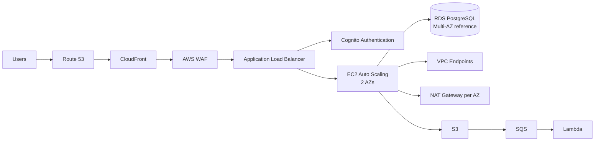

# AWS Secure Customer Portal

A hands-on AWS reference architecture for a customer-facing application that must be reachable from the Internet while keeping application servers, database access, credentials, and administrative paths off the public Internet.

I built the environment manually first, validated the service integrations with real tests, troubleshot failures as they appeared, and then adopted the working environment into Terraform until the final plan showed no drift.

```text
Manual build → Functional testing → Failure diagnosis
→ Terraform import/adoption → Plan review → Apply
→ Final plan: No changes
```

The project focuses on secure edge delivery, private compute, managed identity, Auto Scaling, event-driven processing, monitoring, auditability, threat detection, and Infrastructure as Code.

## Architecture


The diagram represents the **production/reference design**: multiple EC2 application instances across two Availability Zones, RDS Multi-AZ, one NAT Gateway per AZ, and VPC endpoints for selected AWS services.

The hands-on lab intentionally reduced recurring cost while preserving the same architecture patterns:

| Component | Reference design | Hands-on lab |
|---|---|---|
| EC2 Auto Scaling | Minimum 2 across 2 AZs | Min 1 / Desired 1 / Max 2 |
| RDS PostgreSQL | Multi-AZ | Single-AZ |
| NAT Gateway | One per AZ | Not deployed |
| VPC endpoints | S3, Secrets Manager, SSM, SSM Messages | Deployed |
| ALB / app subnets | Multi-AZ | Multi-AZ |

A compact logical flow:



More detail: [Architecture notes](docs/architecture.md)

## What I Actually Tested and Troubleshot

This project was not limited to resource deployment. I deliberately tested the application paths and worked through failures in the running environment.

Three useful troubleshooting cases are documented below:

1. **[Auto Scaling health-check convergence](#1-auto-scaling-health-check-convergence)** — the application returned HTTP 200, but a new instance was still replaced by the ASG.
2. **[Systems Manager private endpoint connectivity](#2-systems-manager-private-endpoint-connectivity)** — private DNS resolved correctly, but SSM still timed out.
3. **[Cognito / ALB client-secret failure](#3-cognito--alb-client-secret-failure)** — rotating the app-client secret caused ALB authentication failures.

The broader validation included:

| Area | Validation |
|---|---|
| WAF | Rate-based blocking tested |
| ALB | Direct origin access restricted |
| Cognito | Authentication flow tested |
| EC2 ASG | Scale-out and scale-in tested |
| RDS | Application DB connectivity tested |
| Secrets Manager | Private credential retrieval tested |
| S3 | Private endpoint access tested |
| SQS/Lambda | Event processing and DLQ tested |
| CloudWatch/SNS | Alarm notification lifecycle tested |
| CloudTrail | Management events and S3 delivery tested |
| Systems Manager | Managed instance online + Run Command tested |
| GuardDuty | Sample findings generated |
| Terraform | Final plan returned no changes |

## Key Engineering Lessons

These were the most transferable lessons from the lab:

- A healthy application process does not guarantee that Auto Scaling health convergence is correctly tuned.
- ALB health thresholds, application bootstrap time, ASG grace periods, and scaling warm-up need to be considered together.
- Private DNS alone is not enough for interface endpoints; the security-group path must also allow the traffic.
- VPC endpoints can eliminate the need for general Internet egress when a workload only needs selected AWS services.
- CloudFront origin restriction prevents users from bypassing WAF and reaching the ALB directly.
- Systems Manager can provide normal private administrative access without inbound SSH.
- Terraform adoption of existing infrastructure requires careful imports and inspection of every proposed change.
- A final no-drift plan is useful proof that the deployed environment and the IaC definition are synchronized.

## Security and Network Design

The VPC uses:

- 2 public subnets for the internet-facing ALB
- 2 private application subnets for EC2
- 2 private database subnets for RDS

Application and database instances have no public IP addresses.

The request path is:

```text
Users → Route 53 → CloudFront → AWS WAF → ALB
      → Cognito authentication → EC2 application → RDS PostgreSQL
```

The ALB accepts HTTPS only from the AWS-managed CloudFront origin-facing prefix list, preventing direct Internet bypass of CloudFront and WAF.

The private application tier uses:

- Encrypted EBS
- IMDSv2
- IAM instance profile
- Security-group-to-security-group access
- Secrets Manager for database credentials
- Systems Manager for administration
- EC2 Instance Connect Endpoint as an additional private SSH path

The database security path is intentionally narrow:

```text
Application SG → TCP/5432 → Database SG
```

### Private AWS Access and NAT

Selected AWS services use private endpoints:

- S3 Gateway Endpoint
- Secrets Manager Interface Endpoint
- Systems Manager Interface Endpoint
- SSM Messages Interface Endpoint

The **production/reference design** also uses one NAT Gateway per AZ so private instances can reach public package repositories, third-party APIs, and other Internet destinations without receiving public IP addresses.

The **hands-on lab omitted NAT Gateways** to reduce recurring cost and intentionally relied on VPC endpoints for the AWS services required by the application.

## Cost-Conscious Lab Choices

I kept the hands-on environment intentionally smaller than the production reference design because the goal was to validate the architecture and operating behavior without paying for unnecessary steady-state capacity.

The main cost reductions were:

- ASG steady state of **1 instance** instead of maintaining 2+ instances continuously
- **Single-AZ RDS** instead of Multi-AZ RDS
- **No NAT Gateways**
- Systems Manager interface endpoints deployed in only the required lab subnet
- Small ARM-based EC2 and RDS instance classes

These choices reduce recurring lab cost, but they are not the production HA recommendation. The reference architecture keeps the multi-AZ design so the availability trade-off is explicit rather than hidden.

I have intentionally not put a single monthly dollar figure here because several components are usage-dependent, including ALB LCUs, CloudFront, WAF, GuardDuty, data transfer, and interface endpoint traffic.

## Troubleshooting

### 1. Auto Scaling Health-Check Convergence

To validate target tracking, I generated sustained CPU load using one `yes` process per available vCPU:

```bash
for i in $(seq 1 $(nproc)); do
  yes > /dev/null &
done
```

This was intentionally simple: the goal was not benchmarking, but creating predictable CPU pressure that would trigger the target-tracking policy.

The ASG scaled from 1 to 2 instances, but the first new instance was replaced even though the application itself was healthy.

I verified:

```text
secure-portal.service → active
GET /health → HTTP 200
```

The problem was timing rather than application failure. The target group originally required 5 consecutive successful health checks at a 30-second interval. Combined with bootstrap time, that could exceed the ASG health-check grace period.

I changed the target group to:

```text
Path                /health
Interval            30 seconds
Timeout             5 seconds
Healthy threshold   2
Unhealthy threshold 2
Matcher             200
```

The replacement instance then reached healthy state correctly.

After stopping the CPU load:

```bash
pkill yes
```

the ASG later scaled back to one instance, validating scale-in and connection draining as well.

### 2. Systems Manager Private Endpoint Connectivity

The application instance had:

- SSM Agent installed and running
- `AmazonSSMManagedInstanceCore` attached
- private DNS enabled on the VPC endpoints

Initially, the SSM Agent still timed out.

I checked DNS resolution and confirmed that the standard Systems Manager service names were resolving to the private interface-endpoint IP addresses. That ruled out the DNS side of the path, but HTTPS still failed.

The problem was the security-group path between the application instance and the endpoint ENIs.

The final model became:

```text
Application SG
  outbound TCP/443
        ↓
Dedicated SSM Endpoint SG
  inbound TCP/443 from Application SG
        ↓
SSM + SSM Messages interface endpoints
```

After fixing those rules, the instance registered as `Online`.

I then validated Run Command without SSH:

```powershell
aws ssm send-command `
  --instance-ids <instance-id> `
  --document-name "AWS-RunShellScript" `
  --parameters 'commands=["hostname","uptime","systemctl is-active secure-portal"]'
```

The command completed successfully and confirmed that the application service was active.

### 3. Cognito / ALB Client-Secret Failure

I also tested Cognito application-client secret rotation.

During the experiment, leaving only the secondary secret caused the ALB authentication path to fail with HTTP 561 responses.

Rather than treating the ALB as the problem, I traced the failure back to the Cognito app-client secret state. I created a new app client with a normal primary secret, updated the ALB authentication configuration, validated the login flow, and then adopted the new client into Terraform.

That was a useful reminder that managed-service integrations can fail at the boundary between services even when each service appears healthy in isolation.

## Event-Driven Processing

The asynchronous data-processing path is:

```text
S3 → SQS → Lambda
```

The queue design includes:

- Main processing queue
- Dead-letter queue
- Redrive policy
- Lambda event source mapping
- Partial batch failure reporting

I validated the path using real S3 object-created events and tested DLQ behavior.

## Monitoring, Audit, and Threat Detection

### CloudWatch and SNS

A CloudWatch alarm monitors visible messages in the SQS dead-letter queue.

The tested path was:

```text
DLQ message → CloudWatch ALARM → SNS → Email
```

After the DLQ was purged, the alarm returned to OK.

### CloudTrail

The multi-region trail records management events with:

- Global service events
- Log file validation
- S3 delivery
- SSE-S3 encryption
- S3 public-access blocking

I validated both S3 delivery and the presence of management API events by changing and restoring an Auto Scaling Group setting.

### GuardDuty

GuardDuty was enabled and validated using AWS sample findings.

The lab enabled the relevant protections for:

- S3
- RDS
- Lambda
- EBS malware protection

EKS-related protection and runtime monitoring remained disabled because this architecture does not use EKS and did not require GuardDuty runtime agents.

## Terraform Adoption

The Terraform part of the project was intentionally an **adoption exercise**, not just a greenfield deployment.

I first built and tested the environment manually. Once the behavior was understood, I defined the equivalent Terraform resources, imported existing infrastructure where supported, reconciled differences, and reviewed every planned change before applying it.

```text
Manual AWS resources
        ↓
Terraform configuration
        ↓
terraform import
        ↓
terraform plan
        ↓
reconcile intended differences
        ↓
terraform apply
        ↓
terraform plan
        ↓
No changes
```

Terraform source: [terraform/lab](terraform/lab/)  
Detailed notes: [Terraform adoption and validation](docs/terraform.md)

Representative workflow:

```bash
terraform fmt
terraform validate
terraform plan -out=tfplan
terraform apply tfplan
terraform plan
```

Final result:

```text
No changes. Your infrastructure matches the configuration.
```

The Terraform configuration is organized around a few major areas rather than a single monolithic file:

- Networking and security
- Compute, load balancing, and Auto Scaling
- Database, secrets, and IAM
- CloudFront, Route 53, ACM, Cognito, and WAF integration
- S3, SQS, Lambda, CloudWatch, and SNS
- CloudTrail, GuardDuty, and Systems Manager

### Adoption Examples

Existing resources were imported instead of recreated.

```powershell
terraform import aws_autoscaling_policy.app_cpu_target `
  "aws-secure-portal-asg/aws-secure-portal-cpu-target"

terraform import aws_vpc_endpoint.ssm `
  "vpce-xxxxxxxxxxxxxxxxx"

terraform import aws_cloudtrail.management `
  "arn:aws:cloudtrail:eu-central-1:<account-id>:trail/securanova-management-trail"

terraform import aws_guardduty_detector.main `
  "<detector-id>"
```

Individual security-group rules were also imported by their `sgr-...` IDs.

Some GuardDuty detector feature resources did not support import with the AWS provider version used in the lab, so I added those resources to the configuration and adopted them through a reviewed apply against the existing detector.

## Scope

This is a hands-on reference architecture and portfolio project. It demonstrates AWS architecture, security, operations, troubleshooting, and Terraform adoption, but it is not presented as a production customer deployment.
