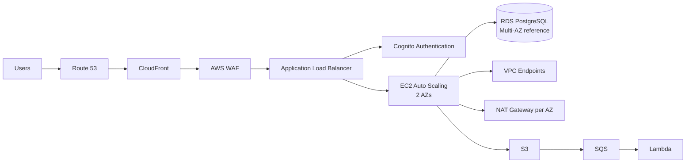

# AWS Secure Customer Portal

A hands-on AWS reference architecture for a secure customer-facing web application, built manually first, validated through real tests, and then fully adopted into Terraform.

The project focuses on secure edge delivery, private compute, managed identity, autoscaling, event-driven processing, monitoring, auditability, threat detection, and infrastructure-as-code.

## Architecture


The diagram represents the **production/reference design**: multiple EC2 application instances across two Availability Zones, RDS Multi-AZ, one NAT Gateway per AZ, and VPC endpoints for selected AWS services.

The hands-on lab intentionally reduced recurring cost while preserving the same architecture patterns:

| Component | Reference design | Hands-on lab |
|---|---|---|
| EC2 Auto Scaling | Minimum 2 across 2 AZs | Min 1 / Desired 1 / Max 2 |
| RDS PostgreSQL | Multi-AZ | Single-AZ |
| NAT Gateway | One per AZ | Not deployed |
| VPC endpoints | S3, Secrets Manager, SSM, SSM Messages | Deployed |
| ALB / app subnets | Multi-AZ | Multi-AZ |

The NAT Gateways provide general outbound Internet connectivity for private instances when workloads need public package repositories, third-party APIs, or AWS services without a VPC endpoint. Where PrivateLink or a gateway endpoint is available, the reference design keeps those AWS-service paths private.

A compact logical flow remains:



More detail: [Architecture notes](docs/architecture.md)

## Design Highlights

- **CloudFront + AWS WAF** provide the public edge and web protection.
- **ALB** accepts HTTPS from the AWS-managed CloudFront origin-facing prefix list rather than from arbitrary internet sources.
- **Amazon Cognito** protects the application before ALB forwards requests to the target group.
- **EC2 Auto Scaling** runs the application only in private subnets.
- **Amazon RDS PostgreSQL** runs in private database subnets and is reachable only from the application security group.
- **Secrets Manager** stores database credentials and is reached privately through an interface VPC endpoint.
- **Amazon S3** is reached through a gateway endpoint. The production/reference design also uses one NAT Gateway per AZ for general outbound Internet access while keeping supported AWS-service traffic on VPC endpoints.
- **S3 → SQS → Lambda** provides asynchronous event processing.
- **CloudWatch → SNS** provides operational alerting.
- **CloudTrail** records management events to a private S3 bucket.
- **GuardDuty** provides threat detection.
- **Systems Manager** provides private operating-system administration without requiring inbound SSH.
- **EC2 Instance Connect Endpoint** remains available as a private SSH path.
- **Terraform** manages the final infrastructure configuration.

## Network Model

The VPC is segmented into:

- 2 public subnets for the internet-facing ALB
- 2 private application subnets for EC2
- 2 private database subnets for RDS

Application and database instances have no public IP addresses.

In the **production/reference design**, each Availability Zone has its own NAT Gateway so private application instances can reach public package repositories, external APIs, and other Internet destinations without becoming publicly reachable. Each private application subnet routes outbound Internet traffic through the NAT Gateway in the same AZ.

Selected AWS services still use private VPC endpoints:

- S3 Gateway Endpoint
- Secrets Manager Interface Endpoint
- Systems Manager Interface Endpoint
- SSM Messages Interface Endpoint

The **hands-on lab omitted the NAT Gateways** to reduce recurring cost and intentionally relied on the VPC endpoints above for required AWS-service connectivity.

## Security Controls

### Edge

Traffic path:

```text
Users → Route 53 → CloudFront → WAF → ALB
```

AWS WAF was configured with:

- Rate-based blocking
- Amazon IP reputation rules
- Common web application protections
- Known bad input protections

The ALB HTTPS security group rule is restricted to the AWS-managed CloudFront origin-facing prefix list.

### Authentication

The ALB HTTPS listener uses Amazon Cognito authentication before forwarding authenticated requests to the application.

The Cognito user pool uses:

- Administrative user creation
- Email verification
- TOTP MFA support
- Managed Login
- Authorization Code flow

### Private Application Tier

EC2 instances use:

- Private subnets
- No public IP
- Encrypted EBS
- IMDSv2
- IAM instance profile
- Security-group-to-security-group access
- Systems Manager for administration

### Database

RDS PostgreSQL is isolated in private database subnets.

The only database path is:

```text
Application SG → TCP/5432 → Database SG
```

Database credentials are retrieved from Secrets Manager instead of being stored in application configuration.

## Auto Scaling Validation

The application Auto Scaling Group uses target tracking:

- Minimum: 1
- Desired: 1
- Maximum: 2
- Metric: `ASGAverageCPUUtilization`
- Target: 30%
- Estimated instance warm-up: 60 seconds
- Health check type: ELB

A CPU load test was generated on the active application instance:

```bash
for i in $(seq 1 $(nproc)); do
  yes > /dev/null &
done
```

The target-tracking alarm caused the ASG to increase desired capacity from 1 to 2.

After stopping the load:

```bash
pkill yes
```

the environment later scaled back to one instance, validating both scale-out and scale-in behavior.

### Health Check Troubleshooting

The first replacement instance was healthy at the application layer but was declared unhealthy by the Auto Scaling Group before it accumulated enough successful ALB health checks.

The original target-group setting required 5 consecutive successful checks. With a 30-second interval and application bootstrap time, convergence could exceed the ASG health-check grace period.

The final target-group settings are:

```text
Path                /health
Interval            30 seconds
Timeout             5 seconds
Healthy threshold   2
Unhealthy threshold 2
Matcher             200
```

After the change, replacement instances reached healthy state correctly.

## Event-Driven Processing

The data-processing path is:

```text
S3 → SQS → Lambda
```

The SQS design includes:

- Main processing queue
- Dead-letter queue
- Redrive policy
- Lambda event source mapping
- Partial batch failure reporting

The queue and DLQ behavior were tested using real S3 object-created events.

## Monitoring and Alerting

A CloudWatch alarm monitors visible messages in the dead-letter queue.

The tested alert path is:

```text
DLQ message → CloudWatch ALARM → SNS → Email
```

After the DLQ was purged, the alarm returned to OK.

## CloudTrail

A multi-region CloudTrail trail records AWS management events with:

- Global service events
- Log file validation
- Management events only
- S3 delivery
- SSE-S3 encryption
- S3 public-access blocking

The trail was validated both by confirming log delivery to S3 and by generating management API activity and confirming the corresponding events.

## Systems Manager

The EC2 application instance runs the SSM Agent and registers through private interface endpoints.

The final private path is:

```text
Private EC2
  → TCP/443
  → SSM / SSM Messages Interface Endpoints
  → AWS Systems Manager
```

The application instance role includes `AmazonSSMManagedInstanceCore`.

Validation included:

- SSM managed-instance status = `Online`
- Run Command
- Application service status check

Example:

```powershell
aws ssm send-command `
  --instance-ids <instance-id> `
  --document-name "AWS-RunShellScript" `
  --parameters 'commands=["hostname","uptime","systemctl is-active secure-portal"]'
```

The command completed successfully and confirmed that the application service was active.

### SSM Troubleshooting

Private DNS initially resolved correctly to VPC endpoint private IPs, but HTTPS connections timed out.

The root cause was the security-group path between the EC2 application SG and the interface endpoint SG.

The final rule model is:

```text
Application SG
  outbound TCP/443
        ↓
Dedicated SSM Endpoint SG
  inbound TCP/443 from Application SG
```

Both the `ssm` and `ssmmessages` endpoints use the dedicated endpoint security group.

## GuardDuty

GuardDuty was enabled and validated with AWS sample findings.

The configuration used in this lab includes:

- Foundational GuardDuty monitoring
- S3 Protection
- RDS Protection
- Lambda Protection
- EBS Malware Protection

EKS-related protection and runtime monitoring were disabled because the architecture does not use EKS and does not require GuardDuty runtime agents.

## Terraform

The project followed a deliberate workflow:

1. Build the AWS resources manually.
2. Validate each service and integration.
3. Troubleshoot real operational issues.
4. Define the equivalent Terraform configuration.
5. Import manually created resources where supported.
6. Reconcile Terraform with the live environment.
7. Apply only reviewed, non-destructive changes.
8. Run a final drift check.

Full notes: [Terraform adoption and validation](docs/terraform.md)

Representative workflow:

```bash
terraform fmt
terraform validate
terraform plan -out=tfplan
terraform apply tfplan
terraform plan
```

Final result:

```text
No changes. Your infrastructure matches the configuration.
```

### Resources Managed with Terraform

The configuration covers the major components of the solution, including:

- VPC and subnets
- Route tables and Internet Gateway
- Security groups
- VPC endpoints
- EC2 Instance Connect Endpoint
- Launch Template
- Auto Scaling Group
- Target-tracking scaling policy
- ALB and target group
- RDS PostgreSQL
- IAM roles and policies
- Secrets Manager
- Route 53
- ACM
- Cognito
- CloudFront
- S3
- SQS
- Lambda
- CloudWatch
- SNS
- CloudTrail
- Systems Manager connectivity
- GuardDuty

## Terraform Adoption Examples

Existing resources were imported instead of recreated.

```powershell
terraform import aws_autoscaling_policy.app_cpu_target `
  "aws-secure-portal-asg/aws-secure-portal-cpu-target"

terraform import aws_vpc_endpoint.ssm `
  "vpce-xxxxxxxxxxxxxxxxx"

terraform import aws_cloudtrail.management `
  "arn:aws:cloudtrail:eu-central-1:<account-id>:trail/securanova-management-trail"

terraform import aws_guardduty_detector.main `
  "<detector-id>"
```

Individual security-group rules were also imported by their `sgr-...` IDs.

Some GuardDuty detector feature resources do not support Terraform import with the provider version used in this lab. Those feature resources were therefore adopted through a reviewed Terraform apply against the already existing detector.

## Key Lessons

- A healthy application process does not guarantee that Auto Scaling health convergence is correctly tuned.
- ALB health thresholds, application bootstrap time, ASG grace periods, and scaling warm-up need to be considered together.
- Private DNS alone is not enough for interface endpoints; the security-group path must also allow traffic.
- VPC endpoints can replace NAT access for workloads that only need selected AWS services.
- CloudFront origin restriction prevents bypassing edge security controls.
- Systems Manager can provide normal private administrative access without inbound SSH.
- Terraform adoption of existing infrastructure requires careful imports and inspection of every proposed change.
- A final no-drift plan is a useful proof that the live AWS environment and Infrastructure-as-Code configuration are synchronized.

## Validation Summary

| Area | Validation |
|---|---|
| WAF | Rate-based blocking tested |
| ALB | Direct origin access restricted |
| Cognito | Authentication flow tested |
| EC2 ASG | Scale-out and scale-in tested |
| RDS | Application DB connectivity tested |
| Secrets Manager | Private credential retrieval tested |
| S3 | Private endpoint access tested |
| SQS/Lambda | Event processing and DLQ tested |
| CloudWatch/SNS | Alarm notification lifecycle tested |
| CloudTrail | Management events and S3 delivery tested |
| Systems Manager | Instance online + Run Command tested |
| GuardDuty | Sample findings generated |
| Terraform | Final plan returned no changes |

## Scope

This is a hands-on reference architecture and portfolio project designed to demonstrate AWS architecture, security, operations, troubleshooting, and Terraform adoption. It is not presented as a production customer deployment.
