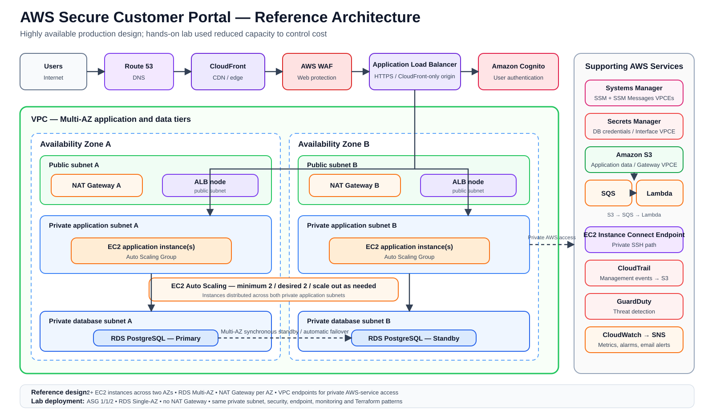

# Architecture Notes



## Reference Design vs Hands-on Lab

The architecture diagram shows the production/reference target:

- Multiple EC2 application instances distributed across two Availability Zones
- RDS PostgreSQL Multi-AZ
- One NAT Gateway per Availability Zone
- VPC endpoints for S3, Secrets Manager, Systems Manager, and SSM Messages

The hands-on lab used the same network segmentation and security model but reduced recurring cost by running ASG Min 1 / Desired 1 / Max 2, RDS Single-AZ, and no NAT Gateway. The Auto Scaling scale-out path across both application subnets was tested.

## Request Path

```text
Users
  → Route 53
  → CloudFront
  → AWS WAF
  → Application Load Balancer
  → Cognito authentication
  → EC2 Auto Scaling Group
  → RDS PostgreSQL
```

## VPC Layout

The VPC spans two Availability Zones and uses six subnets:

```text
AZ-A
├─ Public subnet
├─ Private application subnet
└─ Private database subnet

AZ-B
├─ Public subnet
├─ Private application subnet
└─ Private database subnet
```

The ALB is deployed across the two public subnets.

The Auto Scaling Group uses both private application subnets.

RDS uses a DB subnet group containing both private database subnets. The **reference design uses RDS Multi-AZ** for automatic database failover. The hands-on lab used Single-AZ RDS to control cost while retaining the same two-AZ subnet-group design.

## Private AWS Connectivity and Outbound Access

The reference architecture combines **NAT Gateways and VPC endpoints**:

```text
Private app subnet A → NAT Gateway A → Internet Gateway → Internet
Private app subnet B → NAT Gateway B → Internet Gateway → Internet

EC2 → S3 Gateway Endpoint → Amazon S3
EC2 → Secrets Manager Interface Endpoint → Secrets Manager
EC2 → SSM Interface Endpoint → Systems Manager API
EC2 → SSM Messages Interface Endpoint → Session / command messaging
```

Using one NAT Gateway per AZ avoids making one Availability Zone dependent on a NAT Gateway in another AZ and avoids unnecessary cross-AZ egress paths.

The NAT path is for general outbound Internet access such as OS/package repositories and third-party APIs. Supported AWS-service traffic continues to use VPC endpoints where practical.

The hands-on lab omitted NAT Gateways for cost control and used the endpoints above for the AWS services required by the application.

## Security Group Relationships

```text
CloudFront managed prefix list
        ↓ HTTPS/443
      ALB SG
        ↓ TCP/3000
      App SG
        ↓ TCP/5432
       DB SG
```

Additional private-management paths:

```text
EICE SG → SSH/22 → App SG

App SG → HTTPS/443 → Secrets Manager Endpoint SG

App SG → HTTPS/443 → SSM Endpoint SG
```

## Event Path

```text
S3 object-created event
        ↓
       SQS
        ↓
      Lambda
        ↓
 processing / logging
```

Failed processing can move messages to the DLQ after the configured receive threshold.

## Security / Monitoring

```text
AWS API activity → CloudTrail → S3 audit bucket

AWS telemetry → GuardDuty → findings

CloudWatch metrics → Alarm → SNS → email
```

## Availability Notes

The reference application tier maintains multiple EC2 instances across two Availability Zones behind the ALB. Auto Scaling can add capacity as load increases.

RDS is Multi-AZ in the reference design, providing a standby in a second Availability Zone and automatic failover.

The lab validated the same placement and scaling model at reduced steady-state capacity: one EC2 instance normally running, scale-out to two instances, and Single-AZ RDS to control cost.
